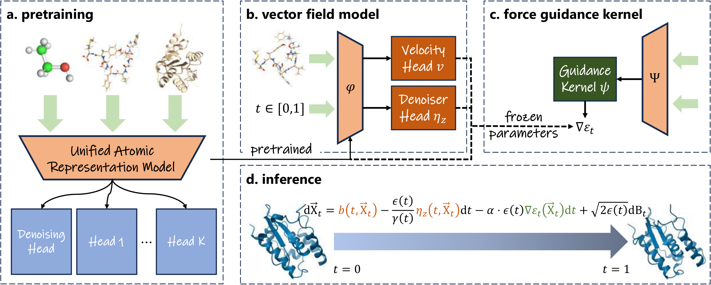

# UniSim BManyPeptidesMD Baseline

This fork contains an adaptation of the UniSim codebase for sampling the [*ManyPeptidesMD*](https://huggingface.co/datasets/transferable-samplers/many-peptides-md) evaluation dataset released in [*Amortized Sampling with Transferable Normalizing Flows*](https://arxiv.org/abs/2508.18175).

The main changes are:
- Modifiying the forcefield to match that used in ManyPeptidesMD.
- TODO

## Installation

We encountered some issues installing using the default yaml files made available. The following was ultimately successful:

TODO can probably simplify this - the LD_LIBRARY... command seems to fix the issue I was having

```bash
# Build initial environment
micromamba env create -f env.yaml 

# Install torch from wheel
pip install torch==1.13.1+cu117 torchvision torchaudio --extra-index-url https://download.pytorch.org/whl/cu117

# Pip installs
pip install pyyaml
pip install mdtraj
pip install e3nn==0.4.4
pip install deeptime==0.4.4
pip install mendeleev==0.15.0
pip install biopython==1.83
pip install tqdm

# Fixes ImportError: /lib/x86_64-linux-gnu/libstdc++.so.6: version `GLIBCXX_3.4.31' not found.
export LD_LIBRARY_PATH=$CONDA_PREFIX/lib:$LD_LIBRARY_PATH

# Test command
python infer_prot.py --config ./config/infer_prot.yaml --index 0
```

# UniSim: A Unified Simulator for Time-Coarsened Dynamics of Biomolecules



## 🧬 Introduction

This is the official repository for our paper "UniSim: A Unified Simulator for Time-Coarsened Dynamics of Biomolecules" published in ICML 2025. We aim to develop a unified generative model for cross-domain molecular time-coarsened dynamics, motivated by the fact that interatomic interactions are consistent by first principles. In parallel, we train portable force guidance kernels to adapt to varying chemical environments, such as solvent conditions and force field parameters. While the current version has not undergone engineering optimization and may not yet be suitable for real-world deployment, we are actively scaling up both the data and model size, as well as improving model architectures for better performance.


## 🚀 Setup

### Dependencies

We provide conda dependencies for `pytorch 1.13.1 + cuda 11.7`. You can directly create and activate a new conda environment by:
```
conda env create -f env_cu117.yaml
conda activate unisim
```

### Datasets

We recommend all datasets should be downloaded under `./dataset`. Note that datasets can be located anywhere you like, **unless you properly modify the corresponding configuration files in `./config`.**

#### ANI-1x

First, create `ANI-1x` directory under `./dataset` and download raw files from [here](https://springernature.figshare.com/articles/dataset/ANI-1x_Dataset_Release/10047041). Run:
```bash
cd data && python ani1x_dataset.py --data_path ../dataset/ANI-1x/ani1x-release.h5
```
Then the training and validation sets `train` and `valid` will be created under `./dataset/ANI-1x`.

#### pcqm4mv2

Create `pcqm4mv2` direcotry under `./dataset` and download and extract raw files by:
```bash
cd ./dataset/pcqm4mv2
wget http://ogb-data.stanford.edu/data/lsc/pcqm4m-v2-train.sdf.tar.gz
tar -xf pcqm4m-v2-train.sdf.tar.gz # extracted pcqm4m-v2-train.sdf
```
Then run the following scripts to create training and validation sets:
```bash
cd data && python pcqm4mv2_dataset.py --data_path ../dataset/pcqm4mv2/pcqm4m-v2-train.sdf
```

#### MD17

Create `md17` directory under `./dataset` and download raw files with suffix `.npz` from [here](http://www.sgdml.org). Run:
```bash
cd data && python md17_dataset.py --data_dir ../dataset/md17 --delta 100
```
**NOTE THAT** MD17 dataset is only used for training the force guidance kernel on small molecules.

#### Solvated Protein Fragments

Create `spf` directory under `./dataset` and download raw files from [here](https://zenodo.org/records/2605372). Run:
```bash
cd data && python spf_dataset.py --data_path ../dataset/spf/solvated_protein_fragments.npz
```

#### PepMD & ATLAS

We provide the processed train/valid sets of PepMD and all test sets used in our paper in [here](https://zenodo.org/records/15401903). Please download the processed file and extract by:
```bash
wget https://zenodo.org/records/15401903/files/unisim_dataset.tar.gz?download=1
tar zxvf ./unisim_dataset.tar.gz
mv unisim_dataset/* ./dataset
```
where `PepMD`, `ATLAS` and `md22` directories will be downloaded and located in `./dataset`.

Moreover, we have provided the train/test splits of ATLAS (`./dataset/ATLAS/train.jsonl` and `./dataset/ATLAS/test.jsonl`) based on sequence identity clustering with the threshold of 0.3. To further curate ATLAS dataset, please create `raw` directory under `./dataset/ATLAS` and download raw `.zip` files according to splits. For example, to download `3omd_B`, run:
```
cd ./dataset/ATLAS/raw
wget https://www.dsimb.inserm.fr/ATLAS/database/ATLAS/3omd_B/3omd_B_analysis.zip
unzip 3omd_B_analysis.zip
```
After all raw files are prepared, please run:
```
cd data && python atlas_fix.py --split ../dataset/ATLAS/train.jsonl
```
The script will calculate the atomic forces and potentials for all conformations of each trajectory using OpenMM, and create a new index file `train_fix.jsonl`. Then, run the following commands to create the training and validation splits:
```
cd data && python atlas_dataset.py --split ../dataset/ATLAS/train_fix.jsonl --delta 10  # 10x10=100ps
```

#### PDB

We provide the processed train/valid sets of PDB in [here](https://zenodo.org/records/15401903). Please download the processed file and extract by:
```bash
cd ./dataset
wget https://zenodo.org/records/15401903/files/PDB.tar.gz?download=1
tar zxvf ./PDB.tar.gz
```


#### Alanine Dipeptide

The PDB file and coordinates of MD trajectories (.xtc format) of AD can be downloaded from [mdshare](https://markovmodel.github.io/mdshare/ALA2/#alanine-dipeptide).


### Model Weights

For reproducibility, we have uploaded the model weights at [Google Drive](https://drive.google.com/drive/folders/1ppIBCjYzZlNC4zfgQDLUynja_d3pIG1t?usp=sharing). You can download them under `./ckpt` directory.

## 👀 Usage

### Training

‼️ Before running training scripts, please make sure all datasets are well prepared following our instructions.

First, use the following command to pretrain a unified atomic representation model:

```bash
GPU=0,1,2,3 bash train.sh ./config/train.yaml
```

we briefly introduce parameters in the configuration file:

```yaml
data:
  dataset: uni                          # default dataset type, DO NOT CHANGE
  same_origin: false                    # whether the selected data in a mini-batch are of the same molecule, set true while training the force guidance kernel
  complexity: "n"                       # pre-defined computational complexity w.r.t. # atoms
  ubound_per_batch: 5_000               # upper bound of the complexity of each mini-batch, depends on CUDA memory
  max_batches: 50_000                   # upper bound of mini-batches in an epoch for each dataset
  path:
    pepmd_train: ./dataset/PepMD/train  # training split of the dataset
    pepmd_valid: ./dataset/PepMD/valid  # validation split of the dataset
    # other pretraining datasets

training:
  lr: 0.0005                            # learning rate
  loss_type: null                       # default: null, DO NOT CHANGE
  warmup: 1_000                         # warm-up steps
  max_epoch: 500                        # maximum training epochs
  grad_clip: 1.0                        # gradient clip, default: 1.0
  batch_size: 4                         # batch size, NOTE THAT you should only specify batch_size=number of GPUs, since mini-batches will be wrapped to one single batch before sending to DataLoader
  save_topk: 5                          # number of saved checkpoints
  shuffle: true                         # whether to shuffle batches during each epoch
  num_workers: 8                        # number of CPU workers, default: 8
  save_dir: /path/to/ckpt/pretrain      # TODO: specify your directory for saving model weights

model:
  encoder: null                         # Available only for training an vector field model, specify the checkpoint path of a pretrained representation model 
  baseline: null                        # Available only for training an force guidance kernel, specify the checkpoint path of a trained vector field model
  ckpt: null                            # set 'ckpt' to the checkpoint path if loading a trained version
  model_type: ekernel                   # model type, pretrain: "ekernel", vector field model: "bm", force guidance kernel: "fbm"
  hidden_dim: 256                       # hidden dimension, default: 256
  ffn_dim: 512                          # FFN dimension, default: 512
  rbf_dim: 64                           # RBF dimension, default: 64
  expand_embed_dim: 32                  # expanded atomic embedding dimension, default: 32
  heads: 8                              # number of attention heads, default: 8
  layers: 4                             # number of model layers, default: 4
  cutoff_lower: 0.0                     # lower bound of cutoff graphs, default: 0.0
  cutoff_upper: 5.0                     # upper bound of cutoff graphs, default: 5.0
  cutoff_H: 3.5                         # Threshold for X-H interactions, default: 3.5
  k_neighbors: 16                       # DO NOT CHANGE
  s_eu: 0.2                             # noise scale for bridge matching
  s_a: 0.04                             # noise scale for denoising pretraining
```

Similarly, to train a vector field model or force guidance kernel, run:
```
GPU=0,1,2,3 bash train.sh ./config/train_bm.yaml        # train a vector field model
GPU=0,1,2,3 bash train.sh ./config/train_fbm.yaml       # train a force guidance kernel
```
**NOTE THAT** `encoder` and `baseline` should be specified for two different training phases, respectively.


### Inference

For peptides or proteins, the following command performs forward simulations with trajectories saved in the format of `.xtc`:
```bash
python infer_prot.py --config ./config/infer_prot.yaml
```

For small molecules in the format of `.npz` (as for MD22), the following command performs forward simulations with trajectories saved in the format of `.npz`:
```bash
python infer_mol.py --config ./config/infer_mol.yaml
```
We introduce parameters in the configuration file:
```yaml
name: none                              # specify an id for the test case if mode == "single"
mode: all                               # "all": generate trajectories for multiple cases, "single": one test case
test_set: ./dataset/ATLAS/test.jsonl    # specify the test split file path (.jsonl) if mode == "all", otherwise specify the PDB file path (.pdb) as the initial state
ckpt: /path/to/ckpt/unisim_atlas.ckpt   # checkpoint path
save_dir: null                          # if null, save trajectories to the same directory as ckpt
inf_step: 1_000                         # length of the trajectory, default: 1000
sde_step: 15                            # discrete SDE steps for inference by bridge matching, default: 15
temperature: 300                        # for compatibility, DO NOT CHANGE
guidance: 0.05                          # force guidance strength, only avaible if using force guidance kernels
use_energy_minim: true                  # whether to use conformation refinement after each inference step
force_field: amber14-implicit           # forcefield parameters
batch_size: 1                           # number of trajectories in parallel, default: 1
gpu: 0                                  # GPU index, -1 for CPU only
```

### Evaluation

We have provided different evaluation scripts for various usage.

If you want to evaluate the trajectory of one single peptide or protein, please run:

```bash
python eval_prot.py --top /path/to/state0.pdb --ref /path/to/MD/trajectories --model /path/to/generated/trajectories [--use_distances]
```
where `--top` specifies the topology file usually in the format of `.pdb`, `--ref` and `--model` specify trajectories generated by MD and the model, respectively. We support multiple format for `--ref` and `--model`, including: `.pdb`, `.xtc`, `.npz` consisting of the key "positions", `.npy`. To reproduce results in our paper, please specify `--use_distances` only for PepMD test set.

If you want to evaluate the trajectory of one single small molecule, please run:

```bash
python eval_mol.py --ref /path/to/MD/trajectories --model /path/to/generated/trajectories --mol <molecule name> --name <model type> [--plot]
```
where `--ref` and `--model` specify trajectories generated by MD and the model, respectively. For MD22 dataset, the trajectory files are both in `.npz` format. `--mol` specifies the name of the test molecule, and `--name` specifies the model type. If `--plot` is specified, corresponding plots will be generated under `./output` directory.

If you want to evaluate trajectories over the whole test set, please run:
```bash
python eval_all.py --config ./config/eval_prot.yaml
```
**NOTE THAT** the scripts is now only available for peptides or proteins. We show the configurations below:
```yaml
test_set: ./dataset/ATLAS/test.jsonl      # test split file, in the format of .jsonl
gen_dir: /path/to/results                 # directory for saving generated trajectories
### the following parameters are used to distinguish different inference settings
sde_step: 25                              # discrete SDE step for inference
inf_step: 1000                            # length of the trajectory
guidance: 0.05                            # force guidance strength
use_distances: false                      # whether to use interatomic distances for computing TIC features
```

If you want to evaluate and compare generated trajectories of one case from different models and generate plots accordingly, please run:

```bash
python eval_compare.py --config ./config/eval_compare_1ar8.yaml
```
where we provide `eval_compare_1ar8.yaml` as reference.

## 💡 Contact

Please feel free to contact us by creating issues in the github repo or sending emails to yu-zy24@mails.tsinghua.edu.cn for any concerns about our project. We thank you for your interest in our work and your contribution to making it better!

## Reference

```
@inproceedings{
    yu2025unisim,
    title={UniSim: A Unified Simulator for Time-Coarsened Dynamics of Biomolecules},
    author={Yu, Ziyang and Huang, Wenbing and Liu, Yang},
    booktitle={Forty-second International Conference on Machine Learning},
    year={2025}
}
```

## License

MIT